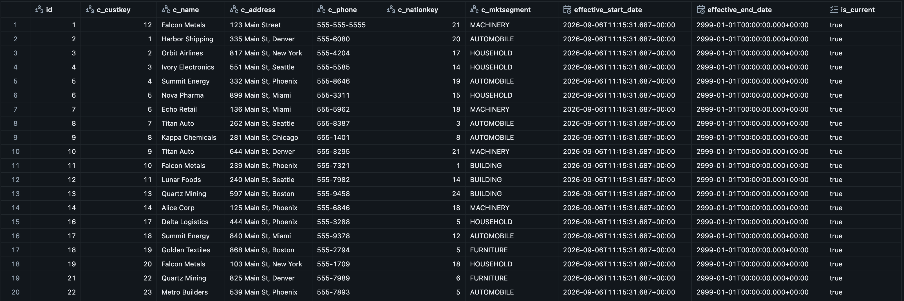
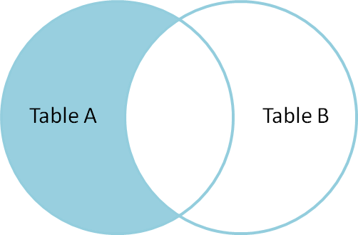

Type 2 slowly changing dimensions (SCDs) retain every version of a dimension
record. When a customer changes address, for example, the old customer row is
closed and a new current row is added. Facts can then be joined to the version
that was valid when the fact occurred.



This is the usual choice when historical reporting must reflect the attributes
known at the time, not today's attributes.

## Dimension shape

Alongside the business key and descriptive attributes, the dimension needs a
validity range and a marker for the open version:

```sql
CREATE OR REPLACE TABLE sandbox.bronze.customer (
	id BIGINT GENERATED ALWAYS AS IDENTITY,
	c_custkey BIGINT,
	c_name STRING,
	c_address STRING,
	c_phone STRING,
	c_nationkey BIGINT,
	c_mktsegment STRING,
	effective_start_date TIMESTAMP, -- Start Date for that record
	effective_end_date TIMESTAMP, -- End date for that record (Future date if the record is active)
	is_current BOOLEAN -- Status True = Record Active, False = Record Inactive/Deleted
) USING DELTA;
```

The current version uses a far-future end date such as `2999-01-01` and
`is_current = true`. A closed row receives the time at which it was superseded
and `is_current = false`.

## Process
We do these changes in multiple phases and steps as follows

### 1. Identify New Records
This is simple Left Anti Join Which can be described as following diagram 


Using left anti join we can simply find records which are available in ingress table but not available in bronze table so that they can be loaded wih current 
```python
new_df = ing_df.join(brz_df,
        col("ing.c_custkey") == col("brz.c_custkey"),
        "leftanti"
    )

new_df = new_df.withColumns({
    "effective_start_date": lit(datetime.now()),
    "effective_end_date": lit(datetime(2999, 1, 1)),
    "is_current": lit(True)
})

display(new_df)
```


### 2. Identify Updated records
Here there is two step mechanism 
1. Identifying old records to mark them inactive and update their `is_current` state to false and `effective_end_date` to today.
```py
insert_updated_df = ing_df.join(brz_df,
                     (col("ing.c_custkey") == col("brz.c_custkey")),
                     "inner"
    ).filter(
        (col("ing.c_name") != col("brz.c_name")) |
        (col("ing.c_address") != col("brz.c_address")) |
        (col("ing.c_phone") != col("brz.c_phone")) |
        (col("ing.c_nationkey") != col("brz.c_nationkey")) |
        (col("ing.c_mktsegment") != col("brz.c_mktsegment"))
    ).select("ing.*").withColumns({
        "effective_start_date": lit(datetime.now()),
        "effective_end_date": lit(date(2999,1,1)),
        "is_current": lit(True)    
    })

display(insert_updated_df)
```
2. Here there is catch we do not update we mark old records deleted as step 1 and then we insert the records as `effective_start_date` today and `effective_end_date` future with `is_current = true`which is similar logic as 1 but just additional step to update old records as false
```
update_old_df = ing_df.join(brz_df,
                     (col("ing.c_custkey") == col("brz.c_custkey")),
                     "inner"
    ).filter(
        (col("ing.c_name") != col("brz.c_name")) |
        (col("ing.c_address") != col("brz.c_address")) |
        (col("ing.c_phone") != col("brz.c_phone")) |
        (col("ing.c_nationkey") != col("brz.c_nationkey")) |
        (col("ing.c_mktsegment") != col("brz.c_mktsegment"))
    ).select("brz.*").withColumns({
        "effective_end_date": lit(datetime.now()),
        "is_current": lit(False)
    })

display(update_old_df)
```

### 3. Identify Deleted Records
This one is similar as identifying new records Similar as 1 but exact opposite logic find records in bronze missing in ingress. Once we have all these simply update end date as today or load date and mark `is_current = false` 
```sql
delete_df = brz_df.join(ing_df,
            col("brz.c_custkey") == col("ing.c_custkey"),
            "left_anti"         
            )

# To mark them as not current and set end date as today specifying it was deleted today
delete_df = delete_df.withColumns({
    "effective_end_date": lit(datetime.now()),
    "is_current": lit(False)
})

display(delete_df) 
```

## Try it

Run [SCD Type 2: Full History](https://github.com/shantanukhond/dwh/blob/main/notebooks/02-scd/SCD%20Type%202%3A%20Full%20History.ipynb) in Databricks. After the initial load, update a customer in ingress and run the comparison and merge cells again. The previous dimension row closes, and a new current version is inserted.
